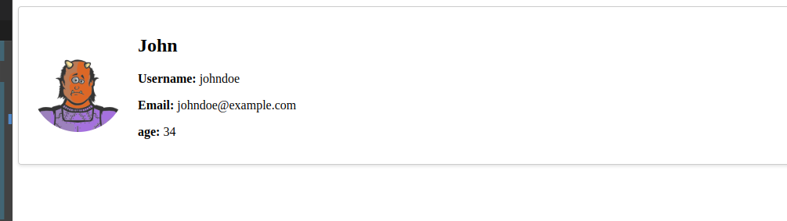

### 1. create a new folder named components inside the src folder.
---
### 2.  Create a new react component called UserProfileCard inside the components folder.
---

### 4. Import the UserProfileCard component in App.js
---

### 5. in App.js you will find an object with the user's data. 
---

### 6. The age property should be a random number form 18 to 100. Generate the number and pass it as a value in the age property.
---

### 7. Pass the user's data from the App.js to the new component as props.
---

### 8. receive the props in the UserProfileCard component.
 you can use ```console.log(props)``` to check how the props looks like 
---

### 9. Inside the UserProfileCard component, render a card-like UI that displays the user's profile information.
---

 inside the App.css there is some css code that you can use. You can play around and change the styling if you want.
---

## result example :



